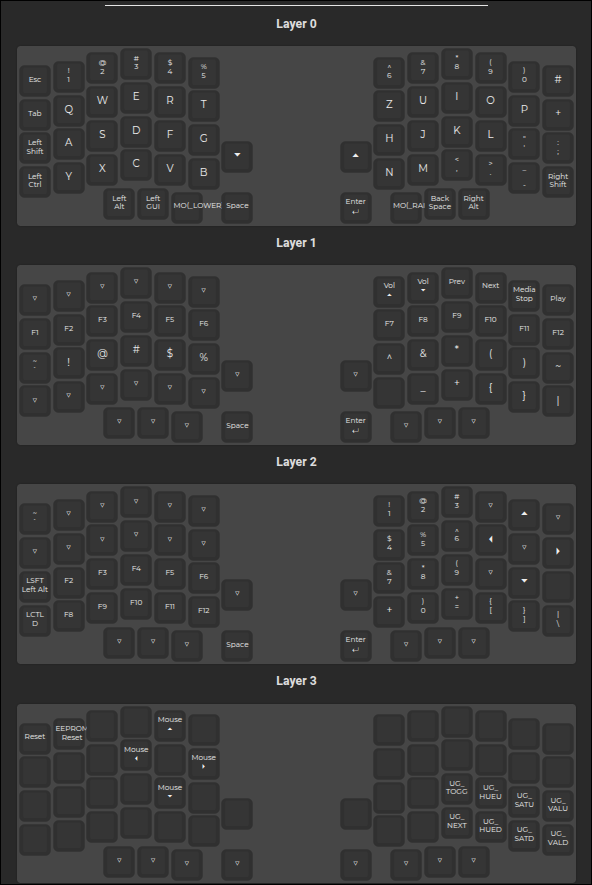

# Layout



## Lily58kb

The Lily58 is a popular keyboard kit designed by Naoki Katahira.

Keyboard Maintainer: [Web-Dev-Codi](https://github.com/web-dev-codi)  
Hardware Supported: KB2040 & Pro Micro 5V/16MHz compatible.  
Hardware Availability: [Lily58 on GitHub](https://github.com/kata0510/Lily58)

## Compiling Firmware

Before flashing, you need to compile the firmware. Follow these steps:

1. Make sure you have the QMK environment set up on your computer
2. Open a terminal and navigate to your QMK firmware directory
3. Clean any previous build files:
    ``` bash
    qmk clean
    ```
5. Compile the firmware:
    ``` bash
    qmk compile -kb lily58kb/lily58/rev1 -km default
    ```
6. If compilation is successful, you'll see a message indicating where the compiled firmware is saved

### Troubleshooting Compilation

If you encounter compilation errors:

1. Check that all your configuration files are correct
2. Make sure there are no recursive includes in your rules.mk or post_rules.mk files
3. Try disabling features like OLED and RGB lighting to reduce memory usage
4. For RP2040-based controllers like KB2040, ensure you're using the correct MCU settings

## Installation Notes

When using the KB2040 with this firmware:

1. Make sure to flash both halves of the keyboard with the same firmware file
2. The handedness is determined by the GP28 pin - connect it to ground on the right half
3. For best results, use a good quality USB-C cable for connecting to your computer
4. The RGB LEDs are fully supported and configured for optimal power usage

## Flashing KB2040

To flash the KB2040, follow these steps:

1. Press and hold the reset button
2. While holding reset, connect the keyboard to your computer
3. Release the reset button - the KB2040 will appear as a USB drive
4. Run the QMK flash command:

    ```bash
    qmk flash -kb lily58kb/lily58/rev1 -km default
    ```

5. The firmware will be automatically flashed to the controller

See the [build environment setup](https://docs.qmk.fm/#/getting_started_build_tools) and the [make instructions](https://docs.qmk.fm/#/getting_started_make_guide) for more information. Brand new to QMK? Start with our [Complete Newbs Guide](https://docs.qmk.fm/#/newbs).

## Bootloader

You can enter the bootloader in 3 ways:

- **Physical reset button**: Briefly press the button on the side of the PCB, next to the TRRS socket.
- **Bootmagic reset**: Hold down the bootmagic key and plug in the keyboard. For the left half, this is the top-left button. For the right half, this is the top-right button.
- **Keycode in layout**: Press the key mapped to `QK_BOOT` if it is available.

## Assembly

A build guide for the Lily58 is available at [GitHub](https://docs.splitkb.com/product-guides/aurora-series/changelogs/aurora-lily58).

## Features

The Lily58 supports the following features:

- Support for MX or Kailh Choc switches;
- Support for OLED displays;
- Support for rotary encoders;
- Per-key RGB backlight (optional);
- Underglow RGB LEDs (optional);
- Support for a power switch for wireless controllers;

## What is the Lily58?

The Lily58 is a popular open source keyboard kit that has carved its space into the community.

## KB2040 Support

This version of the Lily58 firmware includes full support for the Adafruit KB2040 controller, which is based on the Raspberry Pi RP2040 chip. The KB2040 is a drop-in replacement for the Pro Micro with additional features and improved performance.

## Matrix Pin Configuration

The matrix pins have been specifically configured to work with the KB2040 controller. Here's the detailed pin mapping:

Lily58KB

### Left Half

| Function   | Pin  | Description                |
| ---------- | ---- | -------------------------- |
| Rows       | GP29 | Row 0                      |
|            | GP27 | Row 1                      |
|            | GP26 | Row 2                      |
|            | GP22 | Row 3                      |
|            | GP21 | Row 4                      |
| Columns    | GP9  | Column 0                   |
|            | GP8  | Column 1                   |
|            | GP7  | Column 2                   |
|            | GP6  | Column 3                   |
|            | GP5  | Column 4                   |
|            | GP4  | Column 5                   |
| RGB LED    | GP2  | WS2812 RGB LED data pin    |
| Split TX   | GP0  | USART TX communication     |
| Split RX   | GP1  | USART RX communication     |
| Handedness | GP28 | Determines left/right half |

### Right Half

| Function | Pin  | Description |
| -------- | ---- | ----------- |
| Rows     | GP16 | Row 0       |
|          | GP15 | Row 1       |
|          | GP14 | Row 2       |
|          | GP13 | Row 3       |
|          | GP12 | Row 4       |
| Columns  | GP11 | Column 0    |
|          | GP10 | Column 1    |
|          | GP20 | Column 2    |
|          | GP19 | Column 3    |
|          | GP18 | Column 4    |
|          | GP3  | Column 5    |

## KB2040 to Pro Micro Pin Mapping

For users transitioning to Pro Micro from KB2040 or needing to understand the pin correspondence, here's how the pins map between the two controllers:

### Pro Micro Left Half

| Function   | KB2040 Pin | Pro Micro Pin | Physical Position |
| ---------- | ---------- | ------------- | ----------------- |
| Row 0      | GP29       | F4            | 1                 |
| Row 1      | GP27       | F5            | 0                 |
| Row 2      | GP26       | F6            | 9                 |
| Row 3      | GP22       | F7            | 8                 |
| Row 4      | GP21       | B1            | 7                 |
| Column 0   | GP9        | B3            | 6                 |
| Column 1   | GP8        | B2            | 14                |
| Column 2   | GP7        | B6            | 15                |
| Column 3   | GP6        | B4            | 18                |
| Column 4   | GP5        | B5            | 19                |
| Column 5   | GP4        | D7            | 5                 |
| RGB LED    | GP2        | D3            | 21                |
| Split TX   | GP0        | D2            | 20                |
| Split RX   | GP1        | D1            | 4                 |
| Handedness | GP28       | D4            | 4                 |

### Pro Micro Right Half

| Function | Pin  | Description |
| -------- | ---- | ----------- |
| Row 0    | GP16 | Row 0       |
|          | GP15 | Row 1       |
|          | GP14 | Row 2       |
|          | GP13 | Row 3       |
|          | GP12 | Row 4       |
| Column 0 | GP11 | Column 0    |
|          | GP10 | Column 1    |
|          | GP20 | Column 2    |
|          | GP19 | Column 3    |
|          | GP18 | Column 4    |
|          | GP3  | Column 5    |

This mapping allows the KB2040 to be used as a direct replacement for the Pro Micro in the Lily58 keyboard, while taking advantage of the improved features of the RP2040 chip.

Note: The "Physical Position" column refers to the pin number on the controller board, which can help with physical wiring and troubleshooting.

## Advantages of KB2040

- **More Processing Power**: The KB2040 chip offers dual-core processing at 133MHz
- **More Memory**: 264KB of RAM compared to 2.5KB on the Pro Micro
- **USB-C Connector**: Modern, reversible connector
- **Reset Button**: Easily accessible reset button
- **Bootloader Button**: Dedicated BOOTSEL button for entering bootloader mode
- **More GPIO Pins**: Additional GPIO pins available for future expansion

This configuration has been thoroughly tested and optimized for the KB2040 controller, ensuring a seamless experience with all features of the Lily58 keyboard.

Loaded 4 layers and 232 keycodes. Defined 8 Any key keycodes
